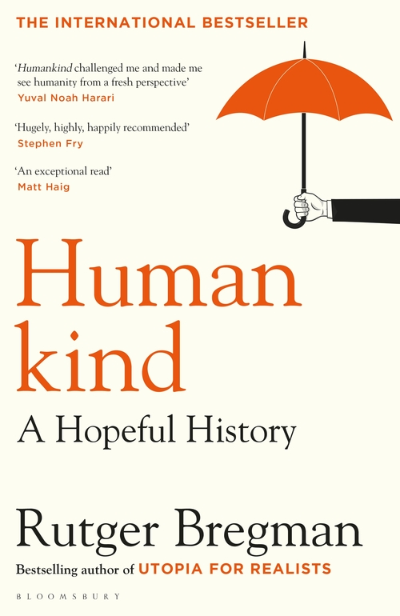
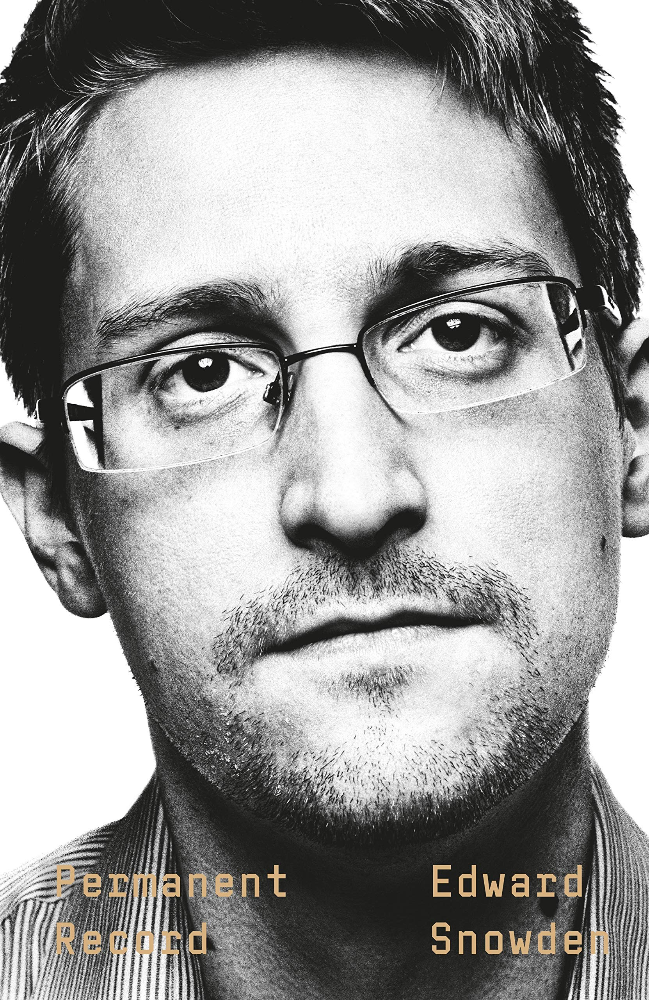
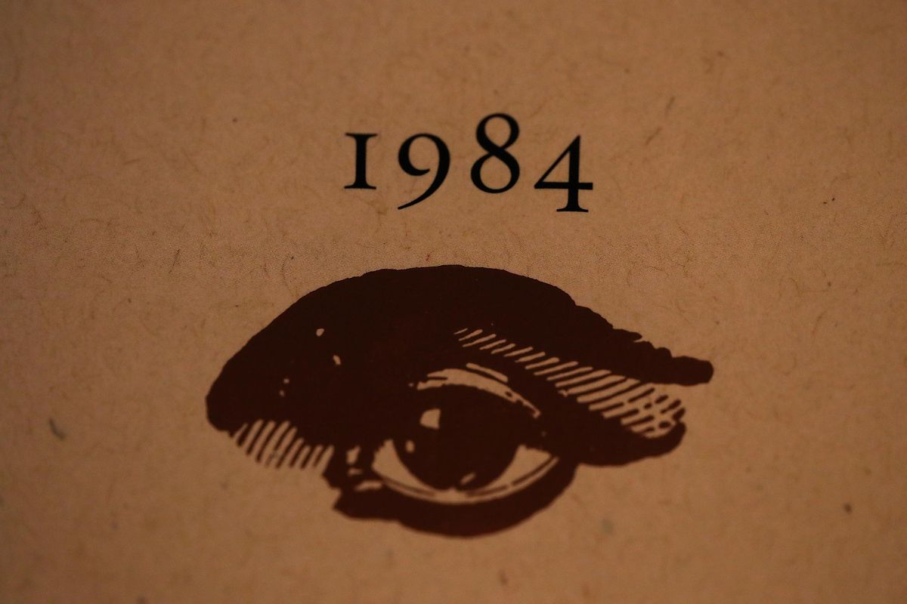

Over the last few years I have begun to read more and more; I believe that reading is an essential part of life and I would encourage anyone who wants to be a healthy adult to read as much as possible. I will be showing the books that I recommend the most, and I find the most important here; sharing what I like about them and the lessons I took away from them.

---

## Stolen Focus: Why you can’t pay attention.
*Johann Hari*

This book is an important analysis of the myriad of reasons that our attention spans are shortening and we can’t focus as much as we once used to.

During the course of this analysis, Hari takes a deep-dive into silicon valley and the reasons that tech companies are using technology to bombard people with information and distractions. He starts with his personal experiences and continues to describe his long journey interviewing many scholars and experts to discover the reasons that so many people struggle with ADHD and other issues around our ability to do meaningful and high quality work.

---

## Humankind: A Hopeful History
*Rutger Bregman*

This non-fiction novel is really a masterpiece and I would recommend it to anyone. It is well written and well researched. I wrote about it in one of my earlier blog posts and at this point consider it to be the basis of most of my political opinions.

It will profoundly reshape the way that you interpret the world and the way in which humans behave because it collects the most influential studies, opinions and philosophies from across history and collates them into one book that refutes the absurd and confirms the sensible answers about civilisation.

If you have any interest in human behaviour, if you’re into politics, anthropology, psychology or sociology; or if you simply wish to understand why our world is so broken, this book is for you.

---

## Permanent Record
*Edward Snowden*

In 2013 he released a massive trove of documents and intelligence that he collected from the NSA about the scope and size of the surveillance program on its own citizens and that of its allies.

In this biography Snowden shares harrowing details, not only about his whistle-blowing activities, but also about how he came to work for the intelligence agencies and the reasons that he came to his decision, as well as the personal sacrifices he had to make to be able to share his secrets with the world.

---

## 1984
*George Orwell*

This is a very well known book by this point, it’s about a tyrannical government which uses every means possible to subdue its population and prevent any form of dissent, down to the tiniest of thoughts.

The true brilliance of this book comes down to the shift in focus that Orwell has from simply warning against some forms of governance as he had done in Animal Farm, towards the more general warning of authoritarianism. More specifically, he warned about the subtle ways in which it can manifest itself in the ways that we use language. He showed that the ironic use of language can lead to people thinking much less deeply about the world and stop them questioning their assumptions about the world.
