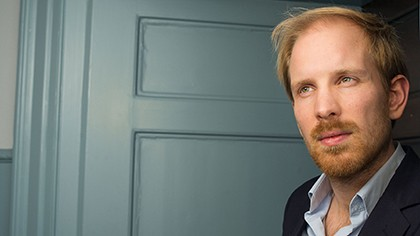

Nearly two years ago now I made [a post](/posts/the-good-in-us-all/) here about a book that I had read regarding human nature called "Humankind: A hopeful history". The Author, Rutger Bregman; a historian and author, lays out historical and scientific studies that support the premise that humans, despite popular opinion, tend to be good people. The main part of the book simply goes through a laundry list of different examples that support this idea; from different studies that show how humans have evolved to be friendly, to disproving other studies that have looked at the dark side of human psychology. At the end of the book, however, Bregman makes a vague call to arms; he uses the premise of the book to support the idea that by putting more trust in normal, average people we might be able to improve society and people's lives. He argues that power tends to corrupt people and effectively advocates for a more direct form of democracy. He strangthens this by adding examples of direct democracy being a more effective form of management, both in government and business.

The first example is of a Dutch care company, "buurtzorg", which is split into smaller care teams of around 25 - 30, largely self-managing, caregivers. The only management involved is the finance department but they are similarly a self-organised group that operates autonomously. This autonomy of smaller groups gives the company the flexibility to deal with issues on a local level and the freedom to innovate on their techniques without compromising on care quality. The company is now one of the largest care companies in the country, providing care at high quality while keeping costs low.

The second example given is a French car parts manufacturer which, after getting a new CEO, decided that management should be far less involved in the day to day running of the company, putting it largely in the hands of the engineers instead. This change allowed them to organise the company in a similar way to buurtzorg. They still have a management structure but it is only engaged when the engineers face an issue that they think would be better solved at a higher level, by management. They have since seen a drop in defective product rates and an increase in profits.

## Direct Democracy.

Lastly, the book introduces the city of Torres, Venezuela which was once racked with corruption and run by a cartel of elites who weren't trusted by anyone. One man decided that he wanted the town to change for the better and ran for Mayor. Instead of simply promising reform and crackdowns on crime though, like so many others had done for decades; he decided that he would simply give the power of Mayor's office back to the people. He would let the people vote on policy proposals, budgets and other matters relating to the running of the town.  

In just ten years, the town of Torres with only 200,000 residents had made much progress; corruption was practicaly non-existent as there were few civil servants needed, democratic participation skyrocketed (most people now participated as they actually had a say). Trust in politicians and government institutions rises when you give people a say in day to day politics, budget allocations and other processes. This kind of system allows people of all colours, backgrounds and levels of education to participate. It's often hard for less educated people who struggle in understanding how things work. This gives them a chance to learn and to be on equal standing with more well off members of the community.

Having a stake in the political process will generate more interest among people who would otherwise not have engaged in politics, this ultimately generates more knowledge about how the system works, more trust in it and more transparency around it. This transparency can, in turn, also create a stronger system and one that is more equal; a system where everyone is involved is usually one where nobody is left behind.

This, then, is what I came away with: we needed a more direct form of democracy if we wanted to have a more inclusive, diverse and adaptive form of government that could take on the political issues of today and tomorrow. I had good mindset, but I was immediately drawn to the idea of online voting for specific proposals; to a nationwide system for deliberation.

The issue is that this kind of system probably doesn't scale as well as we might like. Trying to receive a nuanced opinion of an issue from, say, tens or hundreds of millions of people is not an easy task. Most people don't have the time or the resources to really learn a lot about a problem and fully understand it. This means that any proposal they make or vote they cast would probably be based on a very incomplete understanding. It seems that this was useable for a smaller community, with more local and smaller issues but would be difficult for much larger, nation sized populations which have large and complex problems to solve.

## Less Direct Democracy.

So I got curious; I wanted to see if there were more people who had thought about this kind of issue and if there were other people who had agreed with Bregman. I soon found another book, "Against Elections: The Case for Democracy" by David van Reybrouck, which was actually written much earlier. I was expecting that this book would probably reach a similar conclusion to Bregman; that all people should get directly involved with democracy and that decisions should be made by all.

In actual fact, Reybrouck took almost the opposite view. He started by looking at the birth of democracy, all the way back in ancient Greece. The Greeks had a system of lot drawing which would randomly assign people to positions of power for a short time. These people would get the chance to work on public problems for a while and would then go back to their usual lives. This was far from perfect, for a start the potential recruiting pool consisted only of well-off men, discarding about 80% of all other adults at the time.

But slowly I began to see that parts of this system were far better than our current institutions; for a start keeping people in an office for only 1 shortened term stops that person from being shaped by their office (It seems that a big reasons our leaders end up being so terrible is that power corrupts).

Another benefit is that deliberative bodies, if focused on one thing for an extended length of time and only filled with otherwise normal people, will understand an issue in much greater detail and be able to create much better compromises that work better for most people. This ability to compromise and be able to create a working system for everyone is I think the major benefit of this kind of system.

This might seem like quite the fanciful idea but without practical precident. Quite the opposite in fact; there are multiple very recent examples of the core idea of a deliberative body or a "Citizen's Assembly", working extremely well. 

The first major example 

- Iceland
- Ireland
- France
- East-Belgian
- UK Climate Assembly