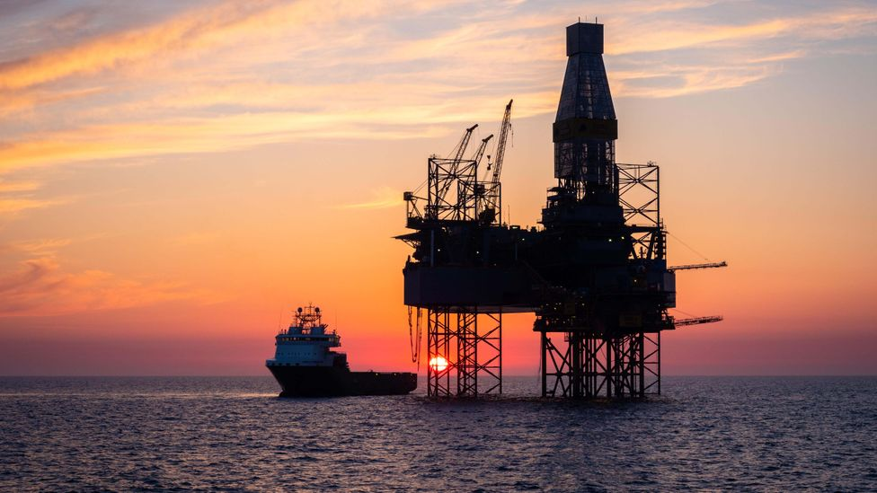

Almost 2 years ago, I began a compulsory sustainability course as part of my degree. In modern times, this isn't such a strange thing to do; it's important that we tackle the climate problem head-on and you can't do that if you don't understand it. It's easy to think "what's there to learn about?", after all, we all know that CO2 and Methane emissions are causing the earth to warm and the climate to change. This course was interesting though; it taught me not just what was happening, but that there were many different ways to address it and there were things already in motion. I understood then that people had been trying to address it and those efforts were accelerating, and also that we need to live more sustainably overall not just emit fewer greenhouse gasses.

Needless to say, this course *was* of use to me and showed me how things could be different. That, however, was when I was shown a 35 minute animated documentary by the name of "[There's no tomorrow (limits to growth and the future)](https://www.youtube.com/watch?v=VOMWzjrRiBg)". As the name suggests; it is downright depressing. The 2010 film from [Incubate Pictures](http://www.incubatepictures.com/index.shtml) is all about the sustainability crisis and how practically all of civilised society is dependent on fossil fuels or other unsustainable industries and practices.

It begins by laying out how our modern way of life is extremely dependent on fossil fuels, how that came to be and the way that our standard of living is almost entirely supported by them. This is, of course, unsustainable; there is significant evidence that global oil production is either nearing or has already passed peak production after which will come a permanent decline.

The way that just oil production declining will affect the global economy is enormous; militaries, cities, companies and governments could downright collapse if oil production stopped suddenly or even curtailed in the next few years. It would stop the production of everything from bikes to electricity dead in its tracks and bring the world economy back by a few hundred years in a matter of months. Even just a small disruption can cause many things to break in the world's supply chain as we have seen very clearly in the last few years. One war has caused fuel prices to jump which, combined with other supply chain issues and economic pains, has in turn, caused excessive inflation.

After elegantly laying out how the world is dependent mainly on oil as well as other kinds of fossil fuels. The film then goes on to lay out how each kind of fuel either already is, or will soon be in decline, one by one. After (rightly) decimating the view that fossil fuels are any sort of stable or reliable basis on which to continue to build our future, the writer goes on to explain how other sources of energy such as nuclear or renewables are either not sustainable, reliable or either. Biofuels are, similarly, no real solution; they either don't have enough energy gain to be viable or they require so much land to work that there wouldn't be enough left for food production and living space.

What I've just described is quite frankly terrible enough. The film still goes on to describe that similar challenges face agriculture and food production, rare earth metals mining and other parts of life. Generally, the message is that the demands of our current way of life vastly outstrip the supply that our planet can produce, that the way we are practically abusing the resources and ecosystems we have, cannot continue.

At this point in an article or film of this kind, the writer often offers a solution, something to back or to hold onto. In this one, however, there is no such light at the end of the tunnel; any sort of solution you think may work does not, any sort of respite is a false hope and anything we try to fix this system is no respite but rather a ploy by those who want to make short term profits.

Now my problem with this film and the writers' view of the world is not necessarily the facts that they present; while some may be a little misleading or perhaps misinterpreted, most seem to be simply true. I'm not going to bother trying to rip apart the facts and I'm no denialist trying to present the disinformed view that everything is, in fact, fine (this wouldn't just be a waste of time, but also counterproductive). Rather I take issue with the way that this is all presented.

It may by now be a bit of a cliché to present a horrible story ending with a light-at-the-end-of-the-tunnel style plea to help do something about it, but there is a good reason behind this style of storytelling. The key is our own human nature, our minds are wired in such a way that our emotions are heavily affected by what we see and hear and usually our decisions in life are , in turn, heavily affected by our emotions. This is why appealing to someone's emotions is key to making sure that your message comes across. This is what, it seems, Incubate have failed to understand in the writing of this documentary.

Without that glimmer of hope or introduction of purpose, all that the film has really achieved is to throw the viewer into a gloomy day or two of despair as they contemplate the seemingly inevitable destruction of humanity. The only question that is left in the viewer's mind after this is "what is the point of even trying to fix the world's issues if this is the inevitable outcome?". The only thing that the film suggests that we do is to get used to the fact that we will have to use less energy; something that the film itself proves earlier on doesn't work in the current workings of the economy: the less energy we use, the less expensive it becomes and the more incentive there would be for someone else to use it.

The point is that this promotes the wrong message; despite the increasingly desperate situation we find ourselves in, there are an ever-increasing amount of ways that we can avoid an all-out catastrophe and imparting a sense of nihilism to the viewer doesn't help anyone. There are many alternative energy sources, some more viable than others, and there are so many people working to try to improve and expand these options. Each use we have for fossil fuels now, can and will be either replaced or turned into a circular economy. Humans, at the end of the day, are resilient creatures and we have faced many difficulties before. This may be our greatest challenge yet but we will endure as a species; even if this wasn't true, what is the point in not even trying?

At the end of the day, the best thing for us to be doing is not to sit and wallow in our despair but for each person to find a problem in the world or society, that they are passionate about and try to use the skills that they have to solve that problem so that they might leave the world a better place than they found it. Once you've achieved this, take a look around you and try to figure out; "How could I have done that better?", "How could I live my life more sustainably?". Each step that you take in this direction, no matter how small, is a benefit to you and those around you, far or near.

-- Chico Demmenie.

[Re-Uploaded & Edited 30/09/2022]
