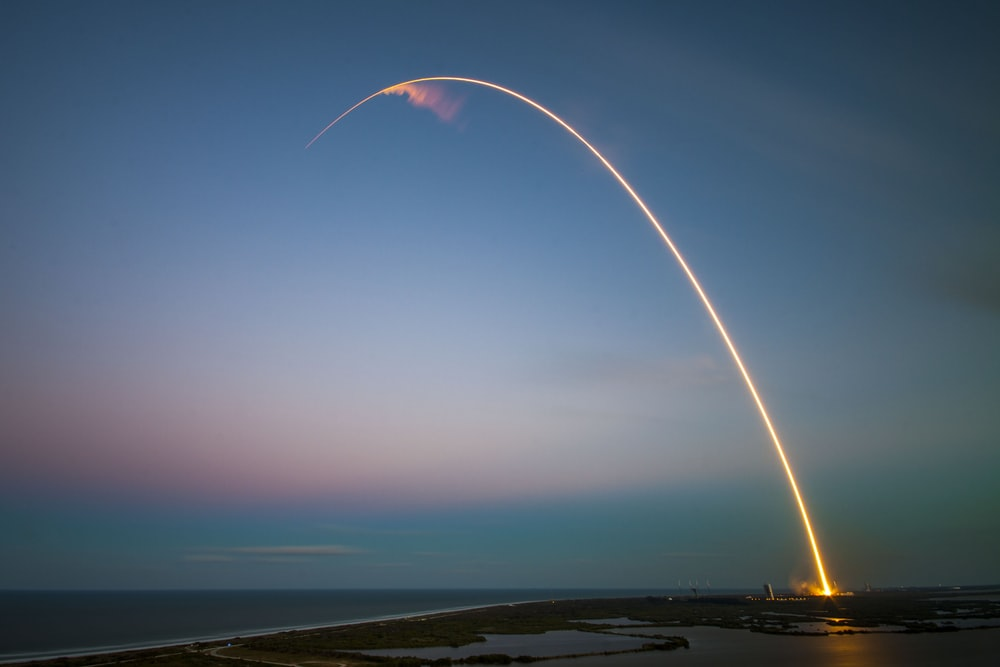
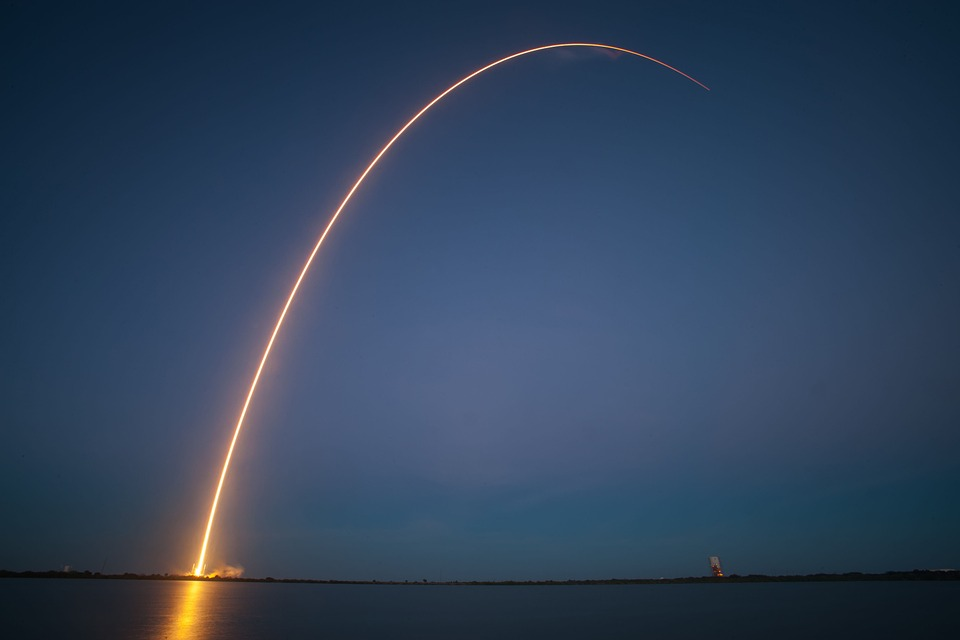

Today we will be looking into the history of spaceflight and how it has been developing aggressively more recently.

## A short history of rocketry and spaceflight.

Rockets first began as an invention in 13th Century China under the Song dynasty when they were used as incendiary weapons by the Chinese navy. It wasn’t until the early 19th century however that the western world adopted rockets as a military weapon when the "Congreve rocket" was developed by Sir William Congreve. He had heard of their effective use by the Mysorean army during the Anglo-Mysore wars in India.

The main reason for the effectiveness of these rockets was their high chamber pressures which could be achieved because they were made from soft hammered iron, in contrast, the European rockets were made from other, less durable materials meaning their range was far less. By 1806 Congreve had perfected the principles that had been used by the Mysorean army and made larger versions which could travel up to 3000 feet (almost 1 Kilometer).

The military use of rockets was further improved throughout the 19th century and in 1861 William Leitch first proposed the use of rocket propulsion for human spaceflight, although it would take nearly half a century before this idea was taken further.

Robert Goddard would propel the world into the modern age of rocketry in 1926 when he attached a ‘de Laval’ nozzle onto a rocket's exhaust and began using liquid propellant instead of solid fuel or gunpowder. This would allow the hot exhaust gases to cool down and break the sound barrier, dramatically improving the efficiency of the rocket. These developments would first lead to the V2 rockets in Nazi Germany as well as many other programs around the world before thrusting human beings to extraordinary heights.

Later on, during the cold war, rocketry once again became quite important militarily. Nuclear weapons began being mounted on top of multi-stage rockets called Intercontinental Ballistic Missiles (ICBM). These would dramatically accelerate the development of the technologies surrounding self-piloting rockets from simple compasses and gyroscopes in the V2 rockets to the complicated computer arrays that we use today.

## Human spaceflight.

The first human spaceflight, of course, took place during the cold war as part of the space race which was intended to show the power and capabilities of the eastern bloc and the western world. Whichever side would come out on top might be able to claim a victory for their side’s ideology. The space race was very much a statement of power, as such it was the priority to get to each milestone as quickly as possible, no matter the cost, no matter the damage.

The first big steps were made by the soviet union; the first man-made satellite in space was achieved in 1957 and nearly 4 years later Yuri Gagarin became the first human to escape the atmosphere and enter space. After the first two victories by the East, US President John F Kennedy raised the stakes by announcing America’s goal of reaching the moon before the decade was out, in a bid to get ahead. The US began the Apollo program, to quickly develop the capabilities needed to achieve this phenomenal feat, their bid was to build the most powerful rocket that has ever existed, a record that still holds to this day.

In the end, America came out on top completing the first and, so far, only moon landings. But after the space race effectively ended, the Apollo program finished and the Saturn V retired. We were left afterwards with nothing capable of anything close to what was achieved in those years. We began dreaming of a more reliable carrier to space and of better things to achieve in space.

The space shuttle seemed to be a natural step for us to take after the achievements of the Apollo program; it would be easier and cheaper to launch and allow us to more easily and reliably put astronauts and equipment into orbit. The shuttle would do exactly as the name suggested, shuttle people and equipment into and out of space and its reusability would make leaps in technology.

Unfortunately, a string of unfortunate decisions and design errors would make it one of the most expensive space programs in the history of spaceflight and, despite its reusability, cost NASA $265 million more per launch than the Saturn V. Part of the problem with the space shuttle was that it wasn’t even nearly entirely reusable, sure the spacecraft went back into space multiple times, but each time, the engines would have to be refurbished, many of the heat resistant tiles that kept it from burning up during re-entry would have to be replaced and it suffered the same problem as the Saturn V; most of its parts were supplied by contractors.

As well as being a very expensive program, the space shuttle was also one of the most dangerous spacecraft ever created with 2 disasters over its 135 launch history, killing 14 crew members.

While the Americans were tied up in making spaceflight more affordable, the Russians were more concerned with making it more reliable. When the Apollo program was still in its early stages, the Soyuz program, which had similar goals to the space shuttle, was already starting. It would prove to be possibly the safest and most reliable spacecraft ever created, it is still the sole spacecraft that carries cosmonauts and astronauts to the ISS today.

## The rise of private space.

In recent years we have seen an incredibly rapid proliferation of space technologies, which has not only transformed the way in which we launch spacecraft but also their uses and the way they impact our lives. This proliferation has largely come about due to the success of certain companies which seek to profit from the exploration of our solar system. These companies have always, of course, been there, since the start of the space industry.

The Saturn V rocket, which took humans to the moon, was made almost entirely of parts that were made by outside contractors; the five massive F1 engines were made by Rocketdyne and the entire first stage was assembled by Boeing. In fact, all NASA projects have always included such contractors, it is a fundamental part of how the US government works. The problem with this form of spaceflight is that each person in the chain needs to make a profit therefore massively inflating the price of a rocket launch. The more of the parts that you can construct yourself, the less the rocket costs and this is exactly what companies like SpaceX are capitalising on.

Just the fact that SpaceX makes roughly 80% of its own components for the Falcon 9 rocket has at least halved the cost per launch of a vehicle into low Earth orbit (not factoring in the reuse capability). SpaceX has not only made the market cheaper for agencies such as NASA and anyone else who wants to get anything into space, but it has also rapidly revolutionized the technologies that make up the space launch industry.

After the dream of reusability in spacecraft had died with the failure of the space shuttle to make space travel easier and more affordable, SpaceX managed not only to make the spaceflight cheaper but it also made its spacecraft reusable with the realization of retro-propulsion, allowing it to land the first stage of its Falcon 9. Furthermore, the rockets need not be refurbished for every launch allowing each rocket to be reused quickly and cheaply (In spaceflight terms).

The result of these developments is that, while the space shuttle cost $265 million per launch, a reused Falcon 9 costs roughly $50 million, less than a fifth the cost.

Although these achievements are simply astonishing, there is a development in the private space industry that I find quite concerning, which is the sale of missions to private individuals, simply for the experience of space. I think that the exploration of space should be reserved for the researchers, engineers and pilots that have allowed us to reach space in the first place.

I think that we should not limit the wonders of the universe, the amazement of being an astronaut to the rich and wealthy. Despite these concerns, SpaceX has simply defied both criticism and expectation by doing what many thought was impossible.

Personally, I believe that in the last decade, this single company has pushed the boundaries of what is possible more than anything surrounding the space industry since a human touched the moon’s surface for the first time in history.

## What does the future hold?

Now that we have reached this point and we have looked back at how far we have come, we should look forward and see what lies ahead.

Over the next few years, NASA’s goal is to establish an outpost on the moon as well as a new space station which will orbit the moon, something it calls ‘gateway’, it will then use this station as a staging point for manned missions to Mars where it aims to establish a colony. The problem with NASA is that, seeing as it is a government agency, its goals are set by the sitting administration and could, therefore, be changed every four years meaning that it doesn’t tend to deliver much on such promises.

By far my biggest problem, however, is that despite the example that SpaceX and, as much as I hate to admit it, Blue origin have set, NASA is still dead set on disposable rockets with their SLS program.

Meanwhile, SpaceX is continuing with its Falcon 9 & Falcon Heavy rockets and they should be launching their first manned mission to the ISS later this year, they also plan to build a new spacecraft: BFR, a two-stage rocket capable of much more than what the Falcon Heavy is achieving at a fraction of the price. They will attempt to use this new craft to carry out both NASA missions to the moon and also private missions to Mars.

In the past and the present, we have done research in space, and have developed new technologies in space, allowing the human race to thrive. Just last week an experiment was sent to the ISS investigating the possibility of 3D printing of human tissues in micro-gravity; possibly enabling us to print new hearts in the future,  which would eliminate the need for organ donation.  

Among the companies of the space industry, there is a new race beginning, one which plants its finishing flag firmly in the red sands of another planet.

## In Conclusion.

Clearly, there are positives and negatives to both the private and the public sides of the space industry, agencies such as NASA, ESA and Roscosmos have the will of the people in mind; this will, however, tends to change drastically and fairly often. Companies such as SpaceX, Blue Origin and ULA, while having an iron will in terms of goals, also have financial gains in mind.

Between both sides of this industry, I believe that we can propel ourselves into the universe, exploring other worlds and pioneering new technologies, for the good of humanity.

-- Chico Demmenie.

[Re-Uploaded & Edited 30/09/2022]
