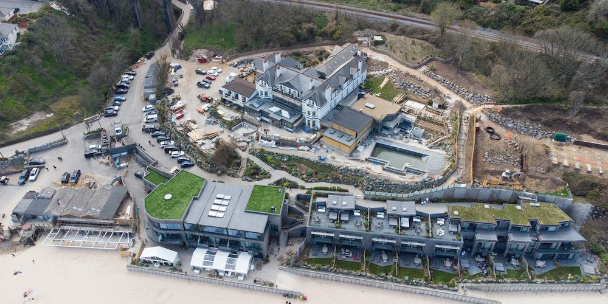
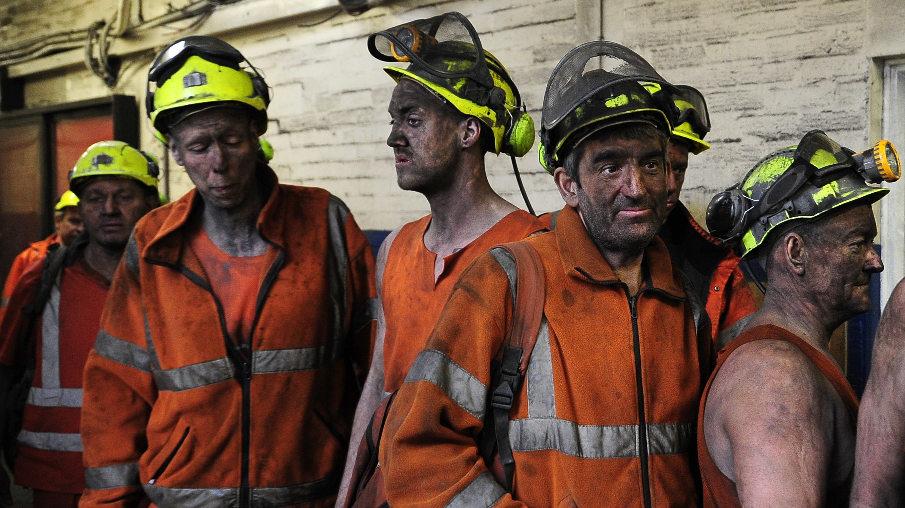
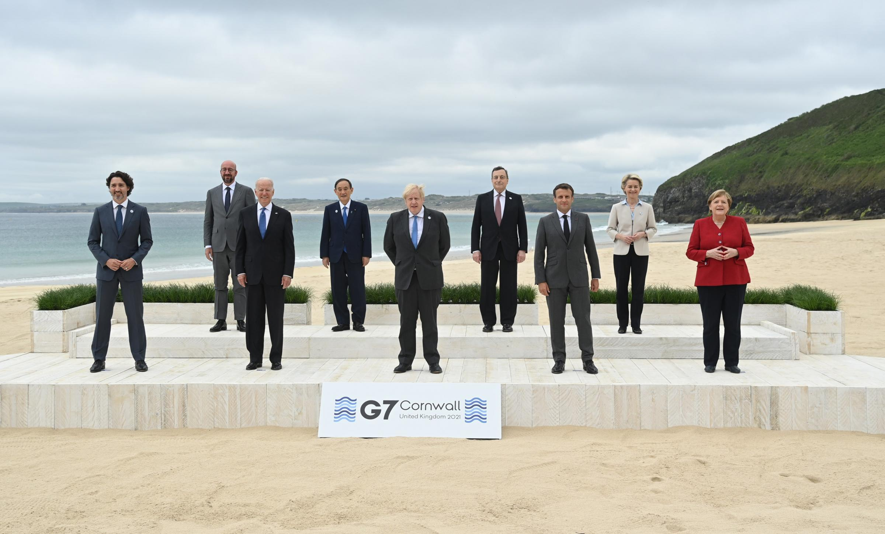

In a small bay, on the northern side of the southwestern tip of England, not too far from lands' end. The usually quiet and quaint town of Hayle has become a flurry of activity with Boris Johnson hosting 7 other countries and representatives from the EU and UN for informal talks in order to address the day's issues. By far the most important issue this year, as in other recent years; is the climate crisis. The UK has possibly committed to the most ambitious climate actions in the world, but will these plans be carried out and can the UK lead the way into a greener future?

The UK has committed to possibly the most ambitious climate goal in the world, to [reduce its emissions by 78% by 2035 compared to 1990 levels](https://www.gov.uk/government/news/uk-enshrines-new-target-in-law-to-slash-emissions-by-78-by-2035). This is set to include international travel and shipping emissions and further commits the UK to its goal of becoming carbon neutral by 2050. The government have also planned to [ban the sale and manufacture of new petrol and diesel engine cars by 2030 and hybrid cars by 2035](https://www.gov.uk/government/news/government-takes-historic-step-towards-net-zero-with-end-of-sale-of-new-petrol-and-diesel-cars-by-2030). This is obviously a big step forward in the fight against climate change and for a more sustainable society, especially when it is considered that the UK maintains strong diplomatic ties with the commonwealth, the US and the EU (to some extent), putting it in a prime position to encourage other countries, poor and wealthy to follow suit.

If, however, the government which has made these big promises, is indeed so committed to the reduction in emissions and the slowing of climate change and global warming; then it has made some other, rather confusing steps which seem contradictory to this message.

In 2015 the last operating coal mine in the UK [closed its pits](https://www.bbc.co.uk/news/uk-england-york-north-yorkshire-35803048) and was later capped off, this was seen by many as the end of coal mining all together. In January of this year however, Cumbria County council [approved the plans](https://www.bbc.co.uk/news/uk-england-cumbria-55561852) for a new deep coal mine to begin construction; a plan that should have been outright rejected by 10 Downing street if they were indeed serious about the reduction of emissions. Instead a public inquiry was set up after a government U-turn following major backlash from environmental groups. Initially [the government welcomed the announcement](https://www.bbc.co.uk/news/science-environment-55668507) of the plans, the complete opposite of the appropriate response considering their commitments in the Paris agreement and more recent announcements.

Another aspect of the governments seemingly contradictory policy on climate which has attracted the attention of climate groups and campaigners is that [the government plans to continue to allow new wells to be drilled](https://www.theguardian.com/environment/2021/mar/24/uk-government-to-allow-new-north-sea-oil-and-gas-exploration) in the north sea for oil and gas exploration. As well as the governments reduction on air travel passenger duty for domestic travel and its refusal to invest substantially in rail travel which would take both cars off the road and planes out of the sky.

Possibly worst of all is that the government has in recent times [cut the foreign aid budget](https://www.bbc.co.uk/news/uk-politics-57379699) from £14 Billion to around £10 Billion, which could significantly handicap smaller nations in their ability to respond to the climate crisis and lead them to rely on fossil fuels as an energy source. If we are to recover from the crisis that we find ourselves in then we need to help smaller countries to stop emitting rather than shifting the blame to them. It is already well known that it is much easier to be sustainable the richer you are; this rings especially true on the scale of nations.

This apparent failure of the government seems to have culminated in the [disappointment for many](https://www.theguardian.com/world/2021/jun/13/johnsons-g7-after-all-the-hype-what-was-actually-achieved) after the end of the G7 summit where it was widely expected that firm deals would emerge rather than vague promises. The government said that it was [waiting until the G20 and COP26 summits](https://www.theguardian.com/world/2021/jun/13/johnsons-g7-after-all-the-hype-what-was-actually-achieved) later this year to make these financial and legal commitments, however it remains to be seen if they will be true to their word.

I'll finish this post by stressing the immense importance of the way in which we continue to strive towards sustainability, the UK has a real chance here to be a leader in the climate response. Just today Oxfam released a report that made clear that the economic impact of a climate disaster, for which we are heading, would wipe $7 Trillion off of the economies of the G7 alone. For that reason and for many more, let's hope that the government intends to keep its promises and insist that they exceed their goals not just reach them.

Edit: Since this post, there has also been a commitment from the G7 to take stricter measures on Coal-fired power plants; closing down plants that don't incorporate carbon capture technology. We have of course yet to see if this has any effect on emissions.

-- Chico Demmenie.

[Re-Uploaded & Edited 30/09/2022]
